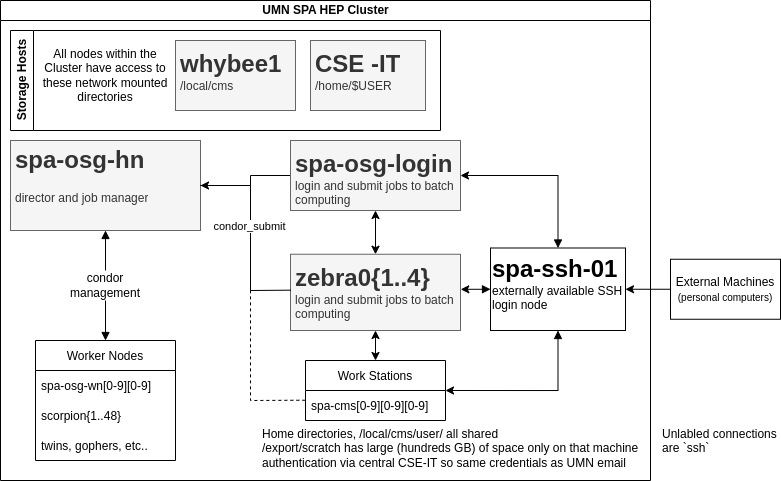

# Cluster Architecture

As mentioned previously, the cluster is designed with simplicity in mind,
keeping longevity as the highest priority. Since the cluster does not see many
users (only ~dozen at any one time), we conciously chose to sacrifice some
performance enhancements in order to maintain a certain level of simplicity in
the cluster design.

### Comments
- OSG stands for [Open Science Grid](https://opensciencegrid.org/).  We have
  designed the cluster in order to (in the future) connect to OSG and allow
  users of OSG to submit jobs from our cluster and write output files to our
  cluster. We do not currently have plans to enable running OSG jobs on our
  cluster unless absolutely necessary (discussions with representatives from OSG
  indicate that this is feasible).
- The head node (`spa-osg-hn`) and the worker nodes are only accessible by
  CSE-IT admins and those of us added as "cluster admins" by IT. Currently, the
  cluster admins are Jeremy and Tom.
- The login nodes (`spa-osg-login` and `zebra0{1..4}`) are intended to be the point
  from which condor jobs are submitted. Additional login nodes could be added if we
  have more users in the future demanding more interactive nodes.
- The external ssh node (`spa-ssh-01`) is actually just a simple redirect to a
  virtual machine which handles all the incoming traffic (`cs-remote-spa-01`).
  Many historic names for this node are included in the list of redirects
  (`spartha`, `login.physics`, `ssh.physics`).
- Future plans for the cluster includes connecting the workstations to the
  condor cluster allowing them to submit jobs directly as well.

## Important Nodes
Most nodes in the cluster are simply "worker" nodes (non-interactive computers for 
running batch jobs) or "workstation towers" (interactive desktop towers used directly),
but there are a few nodes in the cluster that do critical tasks and cannot be simply
recycled when they break down.

### spa-osg-hn
This is the "head node". It does the managerial aspects of our workload manager condor
as well as potentially other cluster-wide, background tasks. It needs to have many cores
to easily run the O(5) daemons running these necessary administrative tasks.

### spa-osg-login
This is the "login node". It is the central interactive node to which people ssh into
in order to login to the cluster and submit batches of jobs to the cluster worker nodes.
It needs to have a large number of cores and memory so that it can hold the O(dozen) users
accessing it at any one time.

In order to distribute the load of users directly interacting with the cluster,
there is an intention to introduce other interactive "login" nodes that have the same
configuration as spa-osg-login but are simply different hardware.

### whybee1
This is the "storage node". It hosts the NFS server which shares `/local/cms/...` across
the entire cluster. It needs to have a high quality and large bandwidth network connection
so users can access the network-attached storage as seamlessly as possible.

**Specs** (as of Aug 2, 2022):
- Dell R320 with iDRAC for remote access
- 48GB of Memory
- 4-core Xeon (on the low side, but NFS server has not been CPU-bound in the past)
- 2 80GB SSDs (raid 1) for TrueNAS OS
- 10GB Fiber Network
- LSI HBA Card for connected JBoDs holding disks
